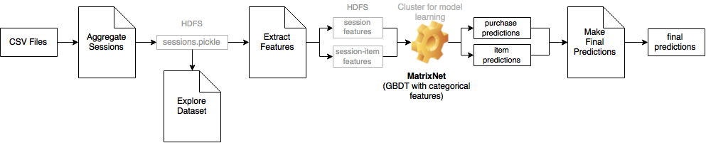

ydf-recsys2015-challenge
========================

Solution of [RecSys Challenge 2015](http://2015.recsyschallenge.com/index.html): Purchase prediction for e-commerce

### Pipeline

### Notebooks

1. [Aggregate Sessions](http://nbviewer.ipython.org/github/romovpa/ydf-recsys2015-challenge/blob/master/notebooks/Yoochoose_AggregateSessions.ipynb)
2. [Explore Dataset](http://nbviewer.ipython.org/github/romovpa/ydf-recsys2015-challenge/blob/master/notebooks/Yoochoose_ExploreDataset.ipynb)
3. [Extract Fetures](http://nbviewer.ipython.org/github/romovpa/ydf-recsys2015-challenge/blob/master/notebooks/Yoochoose_ExtractFeatures.ipynb)
4. [Make Final Predictions](http://nbviewer.ipython.org/github/romovpa/ydf-recsys2015-challenge/blob/master/notebooks/Yoochoose_MakeFinalPredictions.ipynb)

### Data

1. [Input CSV files: train/test sessions from competition website](http://2015.recsyschallenge.com/challenge.html)
3. [Final submission file](data/submission)
2. [Predictions from purchase and item classifiers]()

